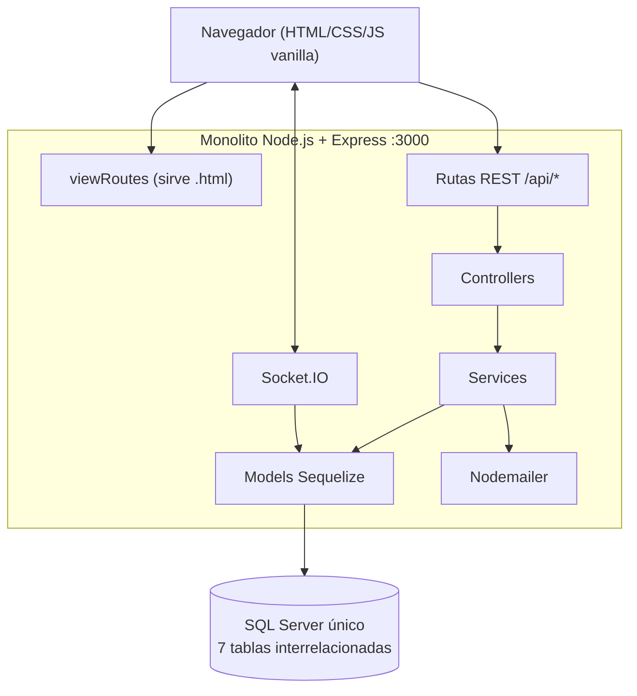
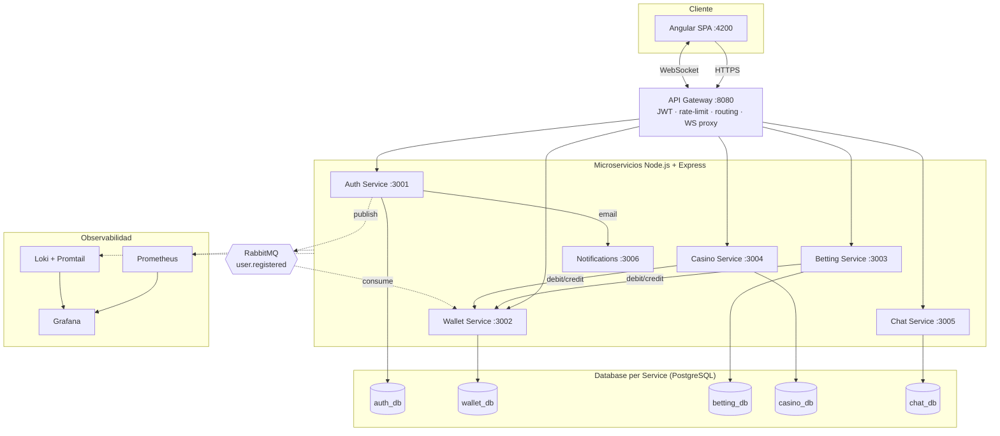
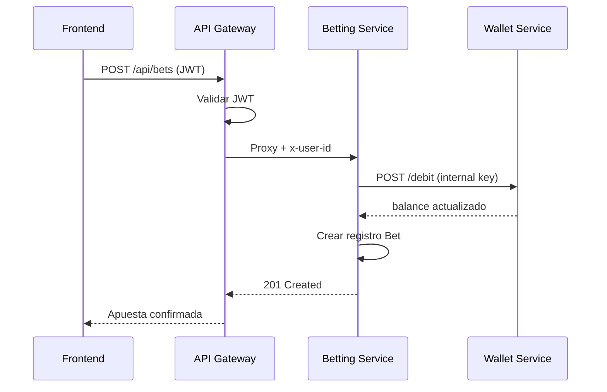

# Arquitectura BetZone v2.0

## Diagrama: Monolito original

## Diagrama: Arquitectura de microservicios

## Bounded Contexts (DDD)

| Contexto | Microservicio | Entidades |
|----------|---------------|-----------|
| Identity & Access | auth-service | User, PasswordResetToken |
| Wallet | wallet-service | Wallet, Transaction |
| Sports Betting | betting-service | Event, Bet |
| Casino Gaming | casino-service | BlackjackGame, MinesGame |
| Real-time Chat | chat-service | Message |
| Notifications | notifications-service | — (stateless) |

## Patrones aplicados

- **API Gateway** — Single entry point, cross-cutting concerns
- **Database per Service** — Aislamiento de datos, independencia de despliegue
- **Event-Driven** — RabbitMQ para creación async de wallets
- **Saga (orquestación simple)** — Betting/Casino: debit → operación → credit (con rollback)
- **Clean Architecture** — routes → controllers → services → models en cada servicio
- **SOLID** — Single Responsibility por microservicio

## Flujo: Colocar apuesta

## Seguridad

| Capa | Implementación |
|------|----------------|
| Autenticación | JWT (HS256), OAuth2/OIDC Google |
| Autorización | Roles user/admin, restrictTo middleware |
| Comunicación interna | x-internal-api-key header |
| Rate limiting | 100 req/min en gateway |
| Headers | Helmet en todos los servicios |
| Secretos | Variables de entorno (.env) |

## Observabilidad

- **Health checks**: `GET /health` en cada servicio
- **Métricas**: `GET /metrics` (Prometheus format)
- **Logs**: Promtail → Loki → Grafana
- **Dashboards**: Grafana con datasource Prometheus + Loki
